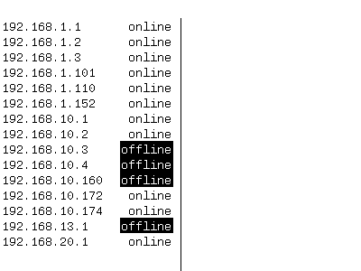

# E-PaperProjectStatus
Use e-paper display as status information. 

# Usage 

## CMake
1. cd CMake
2. cmake .
3. make

## autoconf
 - cd autoconf
 - ./configure
 - make
 
# CrossBuild:
## RaspberryPI:
 - Tools: apt-get install crossbuild-essential-armhf 
### GCC
 - cmake -DCMAKE_TOOLCHAIN_FILE=arm-linux-gnuaebihf.cmake
### LLVM ( clang )
- cmake -DCMAKE_TOOLCHAIN_FILE=arm-linux-llvm.cmake
